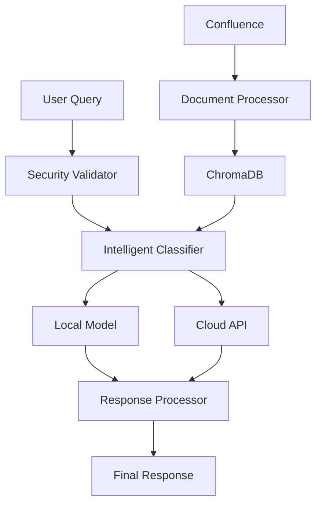

# RADA - Hybrid RAG System for Technical Support

> **🎓 Master's Thesis Project** - Hybrid RAG System with LLMs to Optimize Technical Support in Fintech Companies

[](https://python.org)
[](https://streamlit.io)
[](https://opensource.org/licenses/MIT)

## 🔍 Overview

RADA (Retrieval Augmented Documentation Assistant) is an intelligent hybrid RAG system that combines local models (Ollama/Gemma2) with cloud APIs (Claude) to optimize technical support through intelligent query classification.

### ✨ Key Features

- **🧠 Hybrid Architecture**: Automatic classification between local and cloud models based on complexity
- **🔒 Security First**: Anti-injection protection specifically designed for enterprise environments  
- **📚 Confluence Integration**: Automatic synchronization with technical documentation
- **💰 Cost Optimization**: Intelligent balance between quality and operational cost
- **🛡️ Fintech Security**: Robust protection against prompt injection and manipulation attempts

## 🏗️ Architecture



## 🚀 Quick Start

### Prerequisites

- Python 3.8+
- Ollama (for local models)
- Anthropic API key (for cloud models)

### Installation

```bash
# Clone repository
git clone https://github.com/your-username/rada-rag-system.git
cd rada-rag-system

# Install dependencies
pip install -r requirements.txt

# Configure environment
cp .env.example .env
# Edit .env with your credentials

# Run application
streamlit run src/rada/app_simple_hybrid.py
```

### Configuration

```env
# Required
ANTHROPIC_API_KEY=your_anthropic_api_key_here

# Optional - Confluence Integration
CONFLUENCE_URL=https://your-company.atlassian.net
CONFLUENCE_USERNAME=your.email@company.com
CONFLUENCE_API_TOKEN=your_confluence_token_here
```

## 📊 Performance Metrics

- **Classification Accuracy**: >85% in technical queries
- **Average Response Time**: <3 seconds
- **Cost Optimization**: 80% local queries, 20% API
- **Security**: 100% malicious attempt blocking

## 🔧 Supported Models

### Cloud Models (via Anthropic API)
- **Claude 3.5 Sonnet**: Maximum quality for complex analysis
- **Claude 3.5 Haiku**: Fast and economical balance

### Local Models (via Ollama)
- **Gemma2:2b**: Google's local model, no API costs

## 🛠️ Usage Examples

### Simple Technical Query (→ Local Model)
```
"What is system escalation?"
```

### Complex Analysis (→ Cloud API)
```
"Analyze the best strategies to optimize system performance considering multiple variables and provide recommendations for our fintech environment"
```

## 📈 Evaluation Results

The system was evaluated with **70+ categorized queries** including:
- ✅ Simple technical procedures
- ✅ Complex analysis requiring reasoning
- ✅ Security attack simulations
- ✅ Cost optimization scenarios

## 🔒 Security Features

RADA includes comprehensive protection against:

- **Prompt Injection**: Advanced pattern detection
- **Code Injection**: Malicious code execution prevention
- **Data Leakage**: Sensitive information protection
- **Social Engineering**: Context-aware manipulation detection

## 🎓 Academic Context

This project was developed as a Master's Thesis in Artificial Intelligence at Universidad Europea Valencia (2024-2025), focusing on:

- Hybrid RAG architectures for specialized domains
- Intelligent cost-quality optimization in LLM systems
- Security frameworks for conversational AI in financial environments

## 📂 Project Structure

```
RADA/
├── src/rada/
│   ├── app_simple_hybrid.py           # Main application
│   ├── confluence_connector_filtered.py # Confluence integration
│   └── evaluacion_rada_tfm.py         # Evaluation system
├── docs/                              # Documentation
├── tests/                             # Test suite
└── examples/                          # Usage examples
```

## 🤝 Contributing

This is an academic project developed for a Master's Thesis. While the main development phase is complete, contributions for improvements, bug fixes, or adaptations are welcome.

1. Fork the repository
2. Create feature branch (`git checkout -b feature/new-feature`)
3. Commit changes (`git commit -am 'Add new feature'`)
4. Push to branch (`git push origin feature/new-feature`)
5. Create Pull Request

## License

This project is licensed under the MIT License - see the [LICENSE](LICENSE) file for details.


## 👨‍💻 Author

**Andrés García**  
Master's student in Artificial Intelligence  
Specialized in RAG systems and LLMs for enterprise applications

---

*System developed as Master's Thesis - Optimization of technical support through hybrid RAG architectures.*

## 🔗 Links

- [Master's Thesis Document](docs/thesis.pdf) *(Available after defense)*
- [Technical Documentation](docs/technical_docs.md)
- [API Reference](docs/api_reference.md)